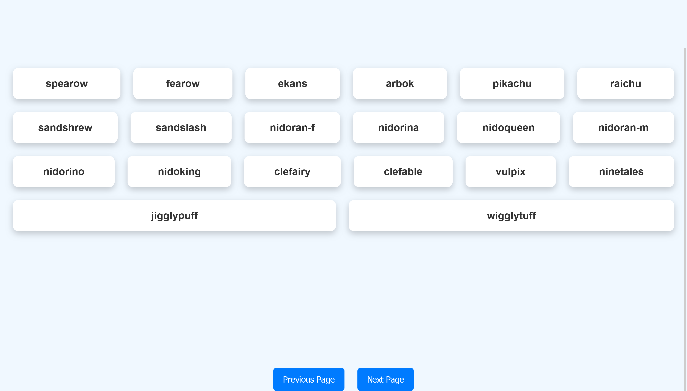

# Pokémon App

A simple application to display a list of Pokémon using the Pokémon API. The app allows you to navigate between pages to fetch different Pokémon.




## Features

- Display a list of Pokémon.
- Navigate between pages.
- Simple and user-friendly interface.

## Installation

1. Clone the repository:
   ```bash
   git clone https://github.com/username/repo.git
